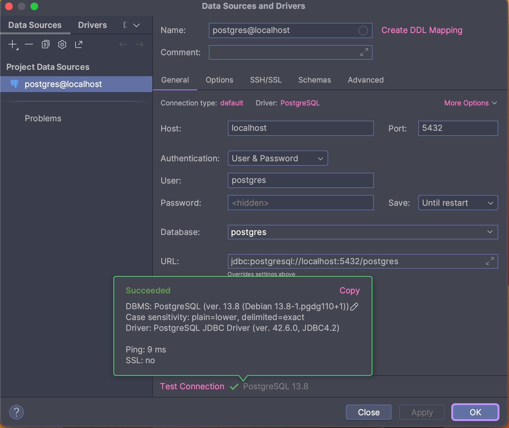

Base de données postgres
===================


- Démarrer docker sur votre poste de travail (si ce n'est pas encore fait).

- Aller dans l'onglet terminal (en bas) 
- ```cd docker```
- ```docker-compose up -d```


Normalement la base de données s'installera
correctement dans le docker. Il vous suffira maintenant de 
configurer l'accès à cette base de données à partir de l'onglet
database.

- Aller dans l'onglet database (en haut à droite).
- Sélectionner l'icone de configuration.
- Inscriver les paramètres, tel que ci dessous.
il vous sera écrit que le driver est manquant.
Vous n'avez qu'à cliquer sur le lien et le driver
manquant s'installera automatiquement.
- Tester votre connection.



- Pour utiliser la base de données, écriver du code sql dans un fichier
  et exécuter ce fichier. Choissisez la console si 
  on vous demande pour quelle instance nous devons l'exécuter.